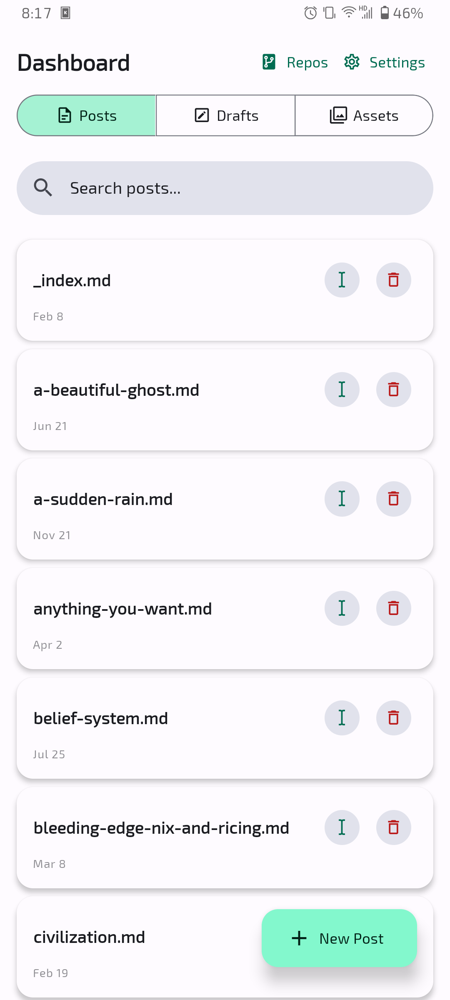
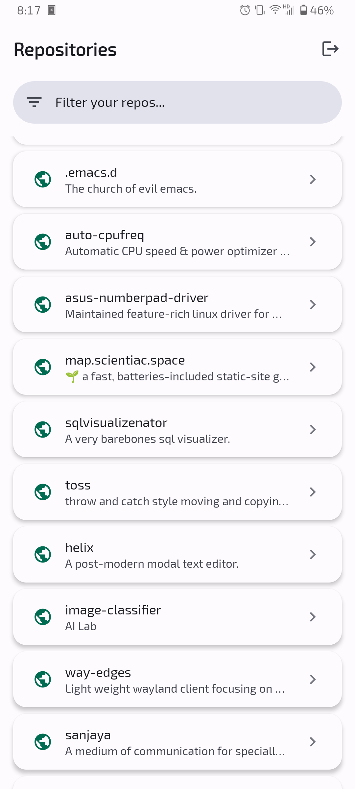
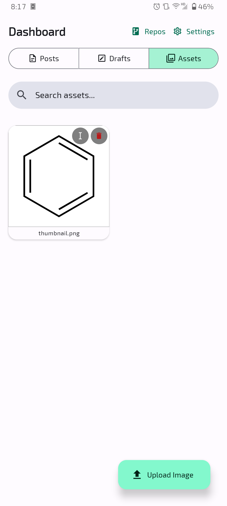
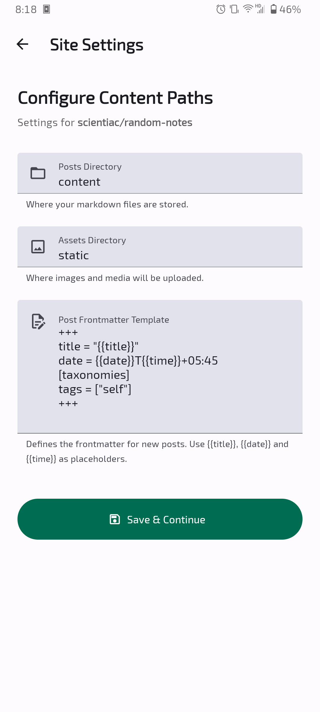

# Flux

A react native app to update blog posts for markdown based github hosted SSG.

It connects to your github and has the ability to create and edit markdown files on the said directory of your selected repo. 

#### Looks

|        |        |        |
| :----: | :----: | :----: |
|  |  |  | 
|  |  |  | 
